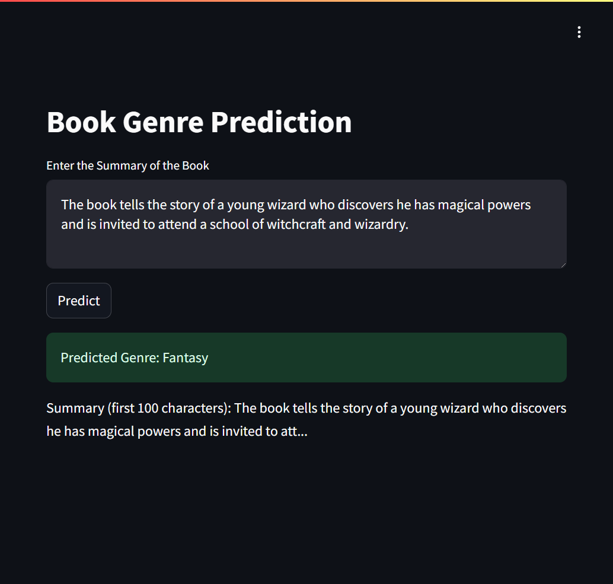

# Book Genre Predictor



## Project Overview

The Book Genre Predictor is a machine learning project that predicts the genre of a book based on its summary. This project uses a Random Forest model to estimate the genre and provides a user-friendly web interface built with Streamlit, allowing users to input book summaries and receive instant genre predictions.

The predictor is based on the CMU Book Summary Dataset, which contains plot summaries for 16,559 books extracted from Wikipedia, along with aligned metadata from Freebase, including book author, title, and genre. The dataset is available [here](http://arxiv.org/abs/1305.1319).

This project demonstrates the application of machine learning in creating a practical tool for readers, authors, and publishers. It serves as an excellent example of an end-to-end data science project, from data preprocessing and model training to deploying a web application with multiple hosting options.

## Table of Contents

1. [Dataset](#dataset)
2. [Model Training](#model-training)
3. [Streamlit Application](#streamlit-application)
4. [Deployment Options](#deployment-options)
5. [File Structure](#file-structure)
6. [Usage](#usage)

## Dataset

The CMU Book Summary Dataset includes the following key attributes:

1. Book title
2. Book author
3. Publication date
4. Genre
5. Plot summary

The dataset can be downloaded from [ArXiv](http://arxiv.org/abs/1305.1319).

## Model Training

The model training process is detailed in the `Book_genre_classification.ipynb` notebook. This notebook covers data preprocessing, exploratory data analysis, and the implementation of the Random Forest model for genre prediction.

## Streamlit Application

The Streamlit application is defined in `app/app.py`. It provides a user interface for inputting book summaries and viewing the predicted genre.

## Deployment Options

There are six ways to deploy and use this application:

1. **Run Locally**:
   - Clone the repository:
     ```
     git clone https://github.com/pouryare/book-genre-prediction.git
     cd book-genre-prediction
     ```
   - Navigate to the `app` directory: `cd app`
   - Create a virtual environment: 
     ```
     python -m venv venv
     source venv/bin/activate  # On Windows use `venv\Scripts\activate`
     ```
   - Install requirements: `pip install -r requirements.txt`
   - Run the Streamlit app: `streamlit run app.py`
   - Open a web browser and go to `http://localhost:8501`

2. **Deploy on Heroku**:
   - Create a Heroku account and install the [Heroku CLI](https://devcenter.heroku.com/articles/heroku-cli).
   - Navigate to the root directory of the project.
   - Login to Heroku: `heroku login`
   - Initialize a Git repository and commit your files:
     ```
     git init
     git add .
     git commit -m "Initial commit"
     ```
   - Create a new Heroku app: `heroku create book-genre-prediction`
   - Push your code to Heroku: `git push heroku main`
   - Open the app: `heroku open`

3. **Use Docker**:
   - Install [Docker](https://docs.docker.com/get-docker/) on your machine.
   - Pull the image from Docker Hub: 
     ```
     docker pull pouryare/book-genre-prediction
     ```
   - Run the container: 
     ```
     docker run -p 8501:8501 pouryare/book-genre-prediction
     ```

   Alternatively, you can build the image locally:
   - Navigate to the `app` directory
   - Build the Docker image: 
     ```
     docker build -t pouryare/book-genre-prediction .
     ```
   - Run the container: 
     ```
     docker run -p 8501:8501 pouryare/book-genre-prediction
     ```

4. **Deploy on Google Cloud Platform**:
   - Set up a [Google Cloud account](https://cloud.google.com/) and install the [Google Cloud SDK](https://cloud.google.com/sdk/docs/install).
   - Create a new project in the Google Cloud Console.
   - Enable the App Engine API for your project.
   - Navigate to the `app` directory.
   - Initialize your app: 
     ```
     gcloud app create
     ```
   - Deploy the app: 
     ```
     gcloud app deploy
     ```
   - Access your app: 
     ```
     gcloud app browse
     ```

5. **Deploy on AWS EC2**:
   - Set up an [AWS account](https://aws.amazon.com/) and create an EC2 instance.
   - Connect to your EC2 instance using SSH:
     ```
     ssh -i "your-key-pair.pem" ec2-user@your-instance-public-dns
     ```
   - Install required packages:
     ```
     sudo yum update -y
     sudo yum install git -y
     sudo amazon-linux-extras install python3 -y
     ```
   - Clone the repository and navigate to the `app` directory:
     ```
     git clone https://github.com/pouryare/book-genre-prediction.git
     cd book-genre-prediction/app
     ```
   - Install the required dependencies:
     ```
     pip3 install -r requirements.txt
     ```
   - Run the Streamlit app using a process manager like `tmux`:
     ```
     tmux new-session -d 'streamlit run app.py'
     ```
   - Configure the EC2 security group to allow inbound traffic on port 8501.

6. **Deploy on Microsoft Azure**:
   - Set up an [Azure account](https://azure.microsoft.com/).
   - Install the [Azure CLI](https://docs.microsoft.com/en-us/cli/azure/install-azure-cli).
   - Login to Azure: `az login`
   - Create a resource group:
     ```
     az group create --name myResourceGroup --location eastus
     ```
   - Create an App Service plan:
     ```
     az appservice plan create --name myAppServicePlan --resource-group myResourceGroup --sku B1 --is-linux
     ```
   - Create a web app:
     ```
     az webapp create --resource-group myResourceGroup --plan myAppServicePlan --name book-genre-predictor --runtime "PYTHON|3.7"
     ```
   - Configure the web app to use Python 3.7:
     ```
     az webapp config set --resource-group myResourceGroup --name book-genre-predictor --linux-fx-version "PYTHON|3.7"
     ```
   - Deploy your code:
     ```
     az webapp deployment source config --name book-genre-predictor --resource-group myResourceGroup --repo-url https://github.com/pouryare/book-genre-prediction.git --branch main --manual-integration
     ```
   - Access your app at `https://book-genre-predictor.azurewebsites.net`

## File Structure
```
book-genre-prediction/
├── app/
│   ├── app.py
│   ├── Dockerfile
│   ├── genre_prediction_model.joblib
│   ├── label_encoder.joblib
│   ├── requirements.txt
│   ├── tfidf_vectorizer.joblib
│   ├── Procfile
│   └── app.yaml
├── Book_genre_classification.ipynb
├── README.md
└── screenshot.png
```

## Usage

1. Open the application (either locally or on a deployed platform).
2. Enter a book summary in the input field provided.
3. Click the "Predict" button to view the predicted genre.

---

This project demonstrates the application of machine learning in creating a book genre prediction tool with a web application interface and multiple hosting options. It serves as an excellent example of an end-to-end data science project with practical applications in literature and publishing.

For any issues or suggestions, please open an issue on the [GitHub repository](https://github.com/pouryare/book-genre-prediction).